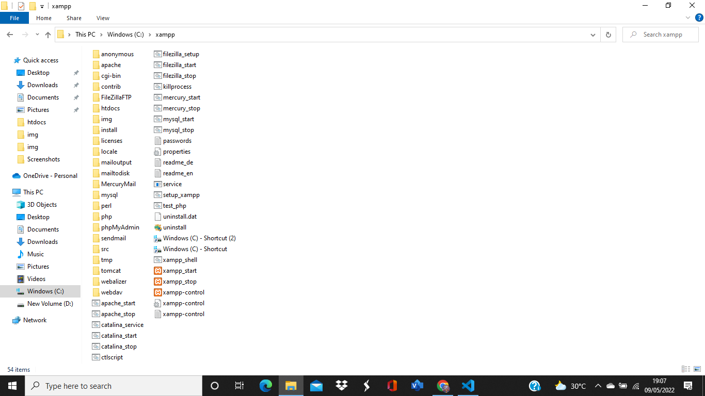

|   HERLIYANSYAH       |    312010387       |
| ---------------------|--------------------|
|  TI.20.A.2           | PEMROGRAMAN WEB    |
|  PERTEMUAN 9         | PRAKTIKUM 7        |

## PERTEMUAN 9

## LAB 7 WEB

Di pertemuan kali ini kita akan mempelajari **PHP DASAR** dengan beberapa beberapa program code ***PHP** nya.

## PHP DASAR

## LANGAKAH - LANGKAH PRAKTIKUM

## 1). INSTALL XAMPP UNTUK SERVER 

**PENJELASAN**

Install **XAMPP** untuk ***WEB SERVER*** dan kemudian ekstrak file nya dan sesuaikan dimana anda menyimpan file tersebut