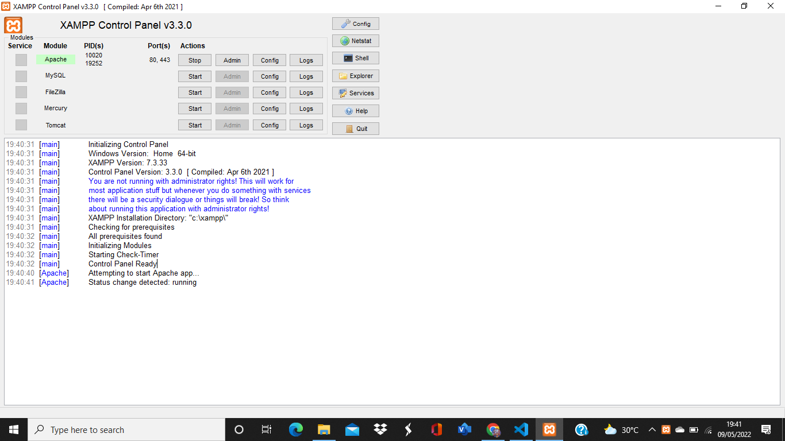

|   HERLIYANSYAH       |    312010387       |
| ---------------------|--------------------|
|  TI.20.A.2           | PEMROGRAMAN WEB    |
|  PERTEMUAN 9         | PRAKTIKUM 7        |


## PERTEMUAN 9

## LAB 7 WEB

Di pertemuan kali ini kita akan mempelajari **PHP DASAR** dengan beberapa program code ***PHP*** nya.

## PHP DASAR

## LANGAKAH - LANGKAH PRAKTIKUM

## 1). INSTALL XAMPP UNTUK SERVER 


**PENJELASAN**

Install **XAMPP** untuk ***WEB SERVER*** dan kemudian ekstrak file nya dan sesuaikan dimana anda menyimpan file tersebut

## 2). MENJALANKAN WEB SERVER


**PENJELASAN**

Mengaktifkan **XAMPP** dengan menekan tombol  **START SERVER APACHE** Seperti gambar di atas

## 3). MEMULAI PHP 
Buat folder lab7_php_dasar pada root directory web server(c:xampp\htdocs)


**PENJELASAN**

Di atas saya membuat folder ***lab7_php_dasar*** yang dimana folder itu disimpan dalam folder **Lab7Web** untuk repository

Kemudian akses directory pada web server dengan mengakses URL:
http://localhost/Lab7Web/lab7_php_dasar/


**PENJELASAN**

Di atas adalah contoh dari tampilan dalam URl atau tampilan server folder tersebut.

## 4). PHP DASAR
Buat File baru dengan nama **php_dasar.php** pada directory tersebut kemudian buat kode seperti berikut.


**PENJELASAN** 

Di atas adalah contoh hasil dari penggunaan **PHP** dalam file html atau **embed**

**code php**
```php
<!DOCTYPE html>
<html lang="en">
<head>
    <meta charset="UTF-8">
    <meta http-equiv="X-UA-Compatible" content="IE=edge">
    <meta name="viewport" content="width=device-width, initial-scale=1.0">
    <title>PHP Dasar</title>
</head>
<body>
    <h1>Belajar PHP Dasar</h1>
    <?php
        echo "Hello World";
    ?>
</body>
</html>
```


